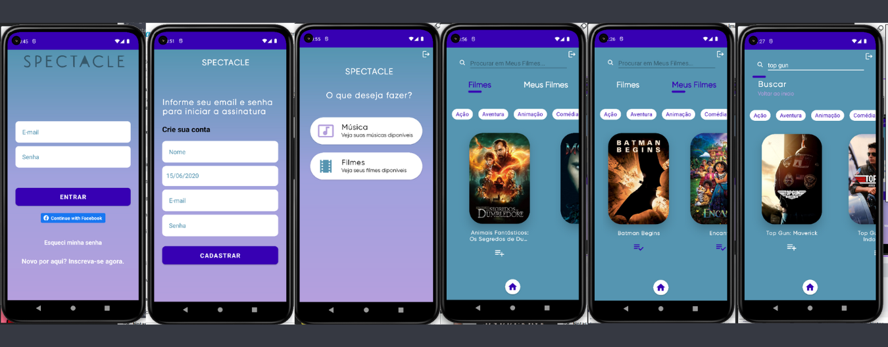

# Spectacle

<h3>:movie_camera: Aplicativo que simula um diário de filmes favoritos e músicas favoritas. :musical_note:</h3>


:pushpin: Cadastro de usuário com Email e Senha autenticados no Firebase;<br>
:pushpin: Login com Email e Senha autenticados no Firebase;<br>
:pushpin: Recuperação de Senha pelo Firebase;<br>
:pushpin: Opção de logar pelo facebook;<br>
:pushpin: Opção de deslogar do aplicativo;<br>
:pushpin: A aplicação armazena os filmes favoritos;<br>
:pushpin: A aplicação armazena as musicas favoritas localmente;<br>
:pushpin: O projeto esta modularizado, seguindo os padrões de arquitetura Clean e MVVM;<br>
:pushpin: Uso do Crashlytics para mapear eventuais falhas de uso;<br>
:pushpin: Busca de filmes pelo nome;<br>
:pushpin: Cenário de erro para filmes não encontrados;<br>


</img>

<p><h3>:dart: APK </h3>

Baixe o APK em seu Celular Android

<a href="https://github.com/sheylaabarrientos/Spectacle/blob/main/app/app-release.apk">DOWNLOAD APK</a>

Passo 1: abra as “Configurações” do seu celular e acesse a aba “Apps e notificações”.<br>
Passo 2: em seguida, expanda a opção “Avançado”.<br>
Passo 3: toque em “Acesso especial a apps”.<br>
Passo 4: na aba seguinte, selecione “Instalar apps desconhecidos”.<br>
Passo 5: com a lista de apps aberta, localize o “Google Chrome” ou outro navegador de sua preferência e abra-o.<br>
Passo 6: habilite a opção “Permitir desta fonte” e agora você poderá instalar um APK baixado no Google Chrome.<br>
Passo 7: agora você poderá baixar um APK de algum site, como o APKMirror, por exemplo.<br>
Passo 8: uma notificação será exibida informando de que o arquivo pode danificar o celular. Clique em “OK” para prosseguir.<br>
Passo 9: aguarde até que o download seja concluído e toque em “Abrir”.<br>

<p><h3>:dart: Pré requisitos App</h3>

Pegue sua chave TheMoviedb API KEY <a href="https://developers.themoviedb.org/3/getting-started">AQUI</a>

Adicione sua Chave TMDB API key no arquivo <a href="https://github.com/sheylaabarrientos/Spectacle/blob/main/app/src/main/java/com/example/spectacle/data/base/Constants.kt">Constants.kt</a>

```bash
PRIVATE_KEY = (tmdb_api_key)
```

<p><h3>:dart: Patterns and Libraries </h3>

Android Jetpack <br>
MVVM<br>
Firebase<br>
Retrofit2<br>
Coroutines<br>
Single Activity Pattern<br>
Material Design<br>
Navigation<br>
ViewModel<br>

<p><h3>:dart: Features </h3>

Login<br>
Subscribe<br>
Reset Password<br>
Logout<br>
Movies<br>
Favorite Movies<br>
Search Movies<br>
Local Data<br>

<p><h3>:dart: Recursos </h3>

:pushpin: <a href="https://developer.android.com/studio?hl=pt&gclid=Cj0KCQjwhqaVBhCxARIsAHK1tiPdisiDGXwVmYPYlTc2h155A0EN4MXDAuz65zL1sbCoZ_1V5DXDgPwaArCQEALw_wcB&gclsrc=aw.ds">ANDROID STUDIO</a><br>
:pushpin: <a href="https://www.themoviedb.org/documentation/api">TMDB API</a><br>
:pushpin: <a href="https://firebase.google.com">FIREBASE</a><br>

<p><h3> :womens: :space_invader: Autora </h3>

<a href="https://www.linkedin.com/in/sheylabarrientos/">Sheyla Barrientos</a>


